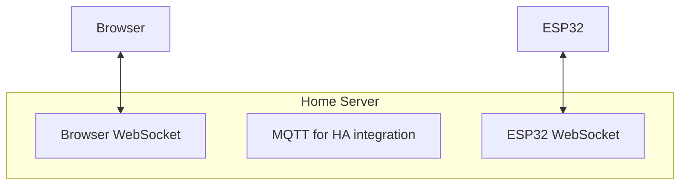

# ⚙️ Tasks

## ✅ OK

## 🔧 To clarify / questions

Test debuggage avec point d'arrêt dans script python du bridge

Refactor project structure:

- by creating a /src folder with a bridge module inside
- by having pyproject.toml export scripts :

  ```ini
  [tool.uv]
  package = true

  [project.scripts]
  start-bridge = "bridge.start_bridge:main"
  live-refresh = "bridge.live_refresh:main"
  ```

- need to rename run commands in corresponding README.md + add a paragprah for saying that a `uv sync` is required : << Add the script to `pyproject.toml` in `[project.scripts]` and execute a `uv sync` cmd from the #prerequisites. >>

### Home server architecture split

Option A (best balance)

- ESP32
  - Controls valves
  - Exposes API (MQTT or REST)
  - Has fallback logic
- Home server
  - Runs scheduler + ET logic
  - Hosts modern web UI
  - Talks to ESP32 over Wi-Fi

👉 No serial. No Nano. Cleaner system.

Option B (even simpler, if reliability matters less)

- ESP32 = actuator
- Server (Pi or other machine) = everything else
- No fallback logic on ESP32

Option C (maximum resilience)

- ESP32:
  - Stores last schedule
  - Can run autonomously if server dies
- Home server:
  - “Advisory brain” that updates schedules

#### What people actually do in practice

The most common real-world pattern looks like:

Hybrid approach (very common)

- ESP32:
  - _Small local UI for fallback (debug + manual override, derived from main UI as a minimal subset)_
  - API (MQTT/REST, and serve version)
  - Core control logic
- Server:
  - Main UI (modern, rich)
  - Scheduling, analytics, integrations

👉 This gives you:

- reliability (device still usable locally)
- flexibility (UI evolves independently)

🧩 Your ideal split

For your irrigation controller:

- ESP32
  - Valve control
  - Safety limits
  - Schedule execution
  - Minimal fallback schedule
  - MQTT client
- Server
  - ET models
  - Weather integration
  - Schedule generation
  - Web UI
  - Data storage

🧠 What “core control logic” actually includes

Think of it as: `What must still work correctly if LTE drops, the server crashes, or your code has a bug upstream?`

1. Valve actuation (the obvious part): This is the ESP32’s primary job.
   - Open/close valves
   - Ensure only allowed combinations run (e.g., no 2 zones if pressure is - limited)
   - Handle timing precisely

2. Safety rules (very important): This is where “logic” really matters.

   Examples:
   - Max runtime per zone (e.g., auto shutoff after 20 min)
   - Leak detection (flow detected when valve should be closed)
   - Prevent all valves opening at once
   - Watchdog reset if system hangs

   👉 These rules should never depend on the server

3. Execution of a schedule (but not computing it)

   Subtle but important distinction:
   - Server: decides what should happen
   - ESP32: executes it reliably

   Example:

   ```JSON
   {
   "zone": 1,
   "start": "06:00",
   "duration": 600
   }
   ```

   ESP32:
   - Stores this
   - Triggers it at the right time
   - Ensures it completes safely

4. Fallback behavior

   If LTE drops:
   - Continue last known schedule
   - Or switch to a safe default

   If MQTT disconnects:
   - Don’t stop watering mid-cycle
   - Don’t open valves unexpectedly

5. Sensor sanity checks

   You don’t need full analytics, but you do want basic validation:
   - Ignore impossible readings
   - Clamp values
   - Detect disconnected sensors

6. Communication handling (light logic)
   - Retry MQTT connection
   - Buffer a few messages if offline
   - Acknowledge commands

❌ What should NOT be “core control logic” (these belong on your server):

- Evapotranspiration calculations
- Weather API handling
- “Smart” irrigation decisions
- Historical analysis
- UI state management

#### Final take

_Layer_ | _ESP32 fallback_ | _Home server_
Serves | Static HTML + JS | Jinja2 templates
Styling | W3.CSS (lightweight) | Tailwind
Interactivity | Vanilla JS | htmx + Alpine.js for animations
API | Direct ESP32 | FastAPI proxy
State | Client JS | Server truth

Pour home server, utiliser Gunicorn/Docker/Kubernetes avec Uvicorn et plusieurs workers.

- the fastapi server computes the best duration and cycle/soak times of each zone, and at what frequency (each day, odd days, once a week,...), all based on future expected weather and evapotranspiration values from soil. Note that the schedule will always start at sunset, and each one just has a priority in the order of execution.
  => FastAPI server computes full irrigation strategy
- then it sends it to esp, as a rolling schedule horizon (always including next 7–14 days) with a "valid until" value, that saves it on flash in case of reboot, or disconnection from fastapi server. After that "valid until" is passed, mark schedule as STALE and use a degraded simple schedule that uses fallback logic and sensors (water each zone with very short duration at low frequency and only if soil is dry to prevent plant death and system overwatering)
  => Adds persistence, autonomy and offline resilience

  ```JSON
  {
  "valid_until": "2026-05-20",
  "events": [
    { "date": "2026-05-06T20:45", "zone": 1, ... },
    { "date": "2026-05-07T20:45", "zone": 2, ... },
    ...
  ]
  }
  ```

  🟢 FastAPI available → optimized irrigation plan
  🟡 FastAPI missing / expired → last known plan
  🔴 last known plan invalid or missing → built-in fallback firmware behavior

- then esp32 checks shortly before execution window (mainly at sunset) what zone it has to water, it will create an optimal execution plan just once (that will execute at sunset) by making zones run in parallel depending on what flow the zones require and what flow is available (thanks to the flowmeter, and all parameters will be known before it starts watering, so nothing will be dynamic once the watering starts). The esp will also check if the soil is moist with humidity sensor and skip or not watering (because of past rain) or if it is currently raining and how much based on sensor (and it is gonna skip watering if the rain sensor exceeds a specific threshold, in mm, that fastapi computed before for that zone as an equivalence of duration and was sent with schedule) and also a probability of rain for future days (esp will compare it with threshold in its config in order to skip watering or not)
  => belong to esp32 because it depends on physical reality, not cloud data. It must work offline and it must react to sensor readings at runtime
  => ESP only does: store list, execute list, apply safety overrides. ESP is determinisc, does not do interpretation (ex: no frequency rule, always explicit schedule with a date): easy to validate, easy to recover after boot.

Recap “Rules belong in the planner. Events belong on the device.” :

🟢 FastAPI (planner)

- computes intelligent decisions
- expands frequency → actual dates
- sends rolling schedule
- includes safety metadata

🟡 ESP32 (executor + safety)

- stores schedule
- executes events
- applies real-time overrides
- handles offline operation



Make the ESP32 connection server-initiated from the ESP32 side: `ESP32 ──connects──► Home Server` and not `Home Server ──connects──► ESP32`

3 possible connection states:

- 🟢 Watering System Online
  => when home server and esp32 are online
- 🟡 Controller Offline (last seen 2 minutes ago)
  Schedule updates cannot be delivered.
  => when home server is online but esp32 is offline
- ⚫ Watering System Unreachable (last seen 1 hour ago)
  => when home server is offline (esp32 connection state is irrelevant here)
